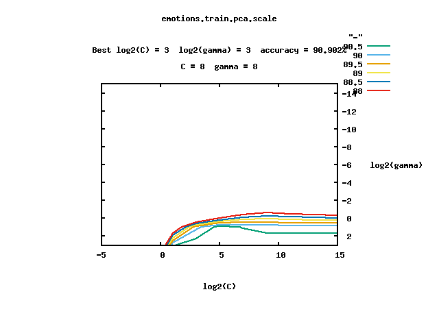

# SVM Emotion Classifier 
Multiclass support vector machine classifier for emotion classification of human faces. 

Originally developed during a summer research project with [Hristo Georgiev](https://github.com/hristogg1) and [Abhijat Biswas](https://github.com/ajdroid). Process tweaked and more databases added to the training data whilst developing my [final year project](https://github.com/mrhysjones/emotive-web) 

Emotions currently classified:
- Anger 
- Contempt
- Disgust
- Fear
- Happy
- Neutral
- Sad
- Surprise

## Databases used
Several databases were used to train the classifier. Due to the nature of the face tracker used, only the frontal face images were used in the training process. 

The training data itself has not been included in this repository. Please visit the individual database websites below for more details on data available and obtaining the data.

- [Extended Cohne-Kanade Dataset (CK+)](http://www.pitt.edu/~emotion/ck-spread.htm)
- [Karolinska Directed Emotional Faces (KDEF)](http://www.emotionlab.se/resources/kdef)
- [The Japanese Female Facial Expression (JAFFE) Database](http://www.kasrl.org/jaffe.html)
- [Radboud Faces Database (RaFD)](http://www.socsci.ru.nl:8180/RaFD2/RaFD?p=main)
- [GEMEP-FERA Dataset](http://sspnet.eu/2011/05/gemep-fera/)

## Training Process
1. Facial landmarks are obtained for the datasets (assumed to be in a Datasets directory) using the [FaceTracker Library](https://github.com/kylemcdonald/FaceTracker). The resultant vectors of landmarks are then categorised by their class label i.e. Angry . See [facetrack.py](facetrack.py) for more details. 
2. Distance measures are calculated from the facial landmarks to obtain feature set. See [calculatefeatures.py](calculatefeatures.py) for details
3. Principal Component Analysis on distance measures to find principal features. See [pca.py](pca.py) for more details. 
4. SVM training on principal components using [LIBSVM](https://www.csie.ntu.edu.tw/~cjlin/libsvm/). This will produce a graphic (see below) for cross validation of the classifier. See [svm.py](svm.py) for more details.

### Example of training process

<code>python facetrack.py</code>

<code>python calculatefeatures.py</code>

<code>python pca.py</code>

<code>python svm.py emotions.train</code>

This will produce files from the PCA process, as well a model and range file for the SVM classifier. 
